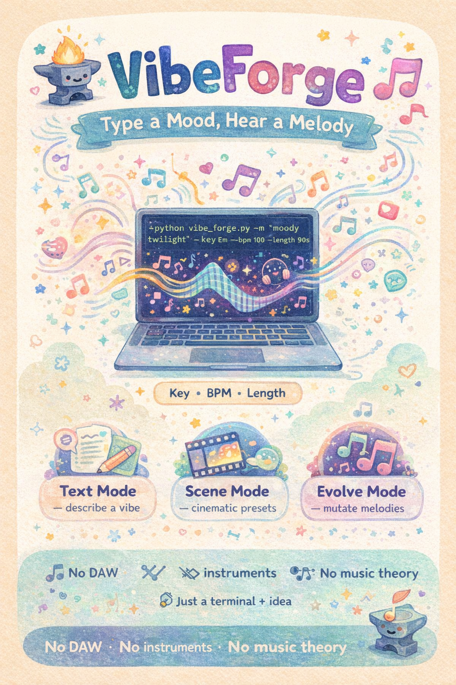

# VibeForge: Text-to-Music Generator

VibeForge is a Python terminal application that generates original melodies from text descriptions. Users type a mood, feeling, or scene description, and the program creates a unique melody that matches the vibe. It also supports evolving melodies through mutation and exporting compositions as MIDI files. No music theory knowledge is required.

## Main Features

- Type any mood or feeling to generate a matching melody
- Choose from cinematic scene presets (rain, space, chase, romance, etc.)
- Evolve and mutate existing melodies to create variations
- Adjust key, tempo, and length for each composition
- Preview melodies as text-based note sequences in the terminal
- Export and save melodies as standard MIDI files
- View history of all generated compositions

## Advanced Topics Used

- File I/O with JSON data loading and MIDI binary export
- Exception handling for invalid inputs and file errors
- Recursion for melody evolution and pattern generation
- List comprehensions and higher-order functions for note mapping
- Dictionary-based data structures for scales and mood mappings
- Unit testing with `unittest`
- Modular design with separate engine files

## How To Run

Go to the `Final Code` folder and run:

python3 main.py

markdown

No extra installation is needed. The project only uses Python standard library modules, including `random`, `json`, `struct`, `os`, `datetime`, and `unittest`.

## How To Use

1. Run `main.py`.
2. Choose **Text Mode** and type a mood description, e.g. `calm night rain`.
3. The program generates a melody and displays the notes in the terminal.
4. Choose **Scene Mode** to pick from preset cinematic vibes (loaded from `scene_presets.json`).
5. Choose **Evolve Mode** to mutate an existing melody into new variations.
6. Select **Export** to save any melody as a `.mid` MIDI file to the `saved/` folder.
7. Choose **View History** to see all previously generated melodies.

## How To Test

From the `Final Code` folder:

python3 -m unittest tests.py

## Project Files

Final Code/
main.py main menu and user interface
models.py data models for melodies and notes
text_engine.py text-to-melody generation engine
scene_engine.py scene preset melody generation
evolve_engine.py melody mutation and evolution logic
file_manager.py MIDI file export and save/load
display.py terminal display formatting
tests.py unit tests for core functions
scene_presets.json cinematic scene preset data
saved/ folder for exported MIDI files

## Built With

- Python
- Python standard library modules only
